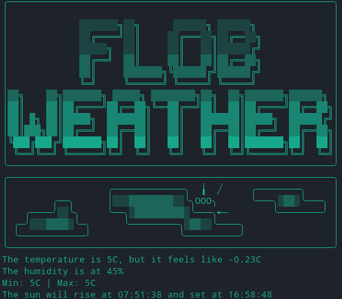

# FLOB Weather
  
**F**(or)**L**(ack)**O**(f a)**B**(etter) **Weather** is a small CLI app that let you ask for weather forecasts directly from you terminal using OpenWeather API.  
The app at the moment has these commands:
* **weather \<location\>**  
  Create a weather clock in the current CLI.
  * Example:  
    The temperature is 10C, but it feels like 8C  
    The humidity is at 57%  
    Min: 7.6C | Max: 12.1C  
    The sun will rise ar 06:00 and set at 18:00  
  
* **forecast \<location\>**  
  Print on screen the weather conditions of the current day and the following four.
  * Example:  
  -sunday 10 january 2021- The temperature will be around 5.41C, with a minimum of 5.12C, and a maximum of 5.81C. Weather of the day: Clouds. The wind velocity will be around 4.31m/s. Finally, the chance of raining in this day is 0.12  
  -monday 11 january 2021- The temperature will be around 4.41C, with a minimum of 3.21C, and a maximum of 4.53C. Weather of the day: Clear. The wind velocity will be around 0.33m/s. Finally, the chance of raining in this day is 0  
  -tuesday 12 january 2021- The temperature will be around 4.39C, with a minimum of 4.39C, and a maximum of 4.59C. Weather of the day: Clouds. The wind velocity will be around 2.55m/s. Finally, the chance of raining in this day is 0.23  
  -wednesday 13 january 2021- The temperature will be around 5.84C, with a minimum of 5.13C, and a maximum of 6.22C. Weather of the day: Clear. The wind velocity will be around 1.95m/s. Finally, the chance of raining in this day is 0  
  -thursday 14 january 2021- The temperature will be around 4.92C, with a minimum of 4.90C, and a maximum of 5C. Weather of the day: Clear. The wind velocity will be around 0.3m/s. Finally, the chance of raining in this day is 0.02

## Prerequisites
This app uses **curl** and **jq**, it also uses OpenWeather API so you have to register on their [website](https://openweathermap.org/) to get the API Key required ( although the company offers paid plans, there is also a free one, and it works perfectly fine for this app).

## Installation
The installation process is pretty easy:
1. Create a folder to store all the files you are going to download from here
2. Clone this repository inside the folder you created
3. Unzip the file
4. launch the installer typing ./Install
5. Follow the instruction in the installer

## Use
Use of this app is pretty straightforward:
* **weather \<location\>**  
  You must specify a location.  
  To kill this app just press 'ctrl' + 'c'  
  If the location is made of more than one word you have to separate them with - (hyphen)  
  * Example:  
    weather san-francisco  
* **forecast \<location\>**  
  You must specify a location.  
  If the location is made of more than one word you have to separate them with - (hyphen)  
  * Example:  
    forecast san-francisco
